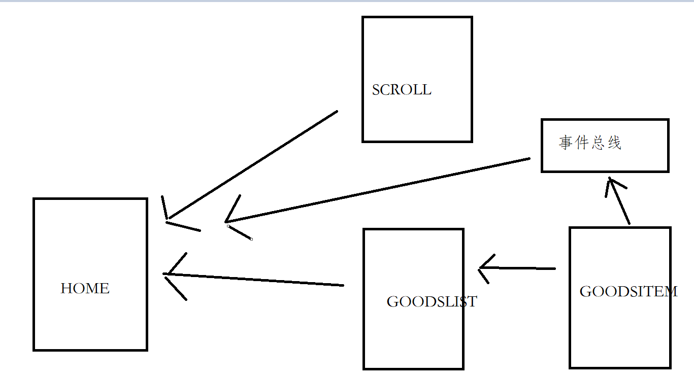

# 项目笔记

1. 路径起别名
   1. 在项目的根路径下新建一个名为 vue.config.js的文件，一定要这个名字，否则cli找不到
   2. 使用
      1. 在html元素里面需要加上 ~属性名+路径
      2. 在js和css import中只是使用属性名+路径

2. 事件总线
   1. 当兄弟组件或者相隔很远的子孙组件进行信息传递时，如果还是使用emits来传递的话，就会显得比较繁琐，而事件总线就是可以借助一个外部独立的组件，来将信息直接传送到目的地。
   2. 事件总线的缺点，由于任意组件都可以随意传送信息，一旦使用错误就会难以维护，因此后面才会出现了vuex
   3. 
   4. 实现方式
      1. 将事件总线独立成一个公共组件import Vue from 'vue' export const EventBus = new Vue( )
      2. 将事件总线作为Vue的原型：Vue.prototype.$EventBus = new Vue()
   5. 博客 <https://blog.csdn.net/sinat_17775997/article/details/82924272?ops_request_misc=&request_id=&biz_id=102&utm_term=%E4%BA%8B%E4%BB%B6%E6%80%BB%E7%BA%BF&utm_medium=distribute.pc_search_result.none-task-blog-2~all~sobaiduweb~default-6-82924272.pc_search_result_hbase_insert>